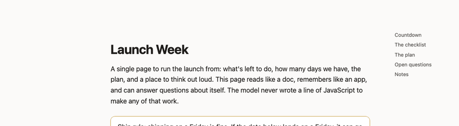

# simply-html

[](https://github.com/aanishs/simply-html/actions/workflows/ci.yml)
[](LICENSE)

**Your AI agent makes a lot of markdown. Most of it is a dead wall of text you'll never read.
simply-html makes it *alive*.**

Point it at the markdown or HTML your agent already writes — a plan, a report, a doc — and it
becomes a real page you can actually *use*: read it nicely, **edit it by selecting text and saying
what to change**, and even turn it into a **tiny interactive app**. Your plan files can be dynamic
and cool. That's the whole idea — once an agent writes HTML instead of flat markdown, it can make
almost *anything*, and you didn't write a line of code.



> Status: **v0 — a fun experiment.** Built to see how far one idea goes. Rough edges; ideas welcome.
> Try it: [a page behind a PIN](https://sh-launch-week-69b6.vercel.app) (PIN `8156`), or the quickstart below.

## What your agent can make

Not just *prettier* markdown — **dynamic** pages. All of this is just HTML + a sprinkle of `data-sh-*`
directives, authored by your agent:

- **A plan that isn't a wall of text** — collapsible phases, a checklist you tick off, a live "3 of
  9 done (33%)" counter, and a "hide completed" filter. ([`examples/plan.html`](examples/plan.html) —
  this is the thesis, made real.)
- **A doc you edit by talking** — select a paragraph, say *"turn this into a 3-item checklist,"* and
  your local `claude`/`codex` CLI rewrites just that bit, in place.
- **Charts, with no chart library and no model JS** — `<div data-sh-chart="bar" data-sh-values="categories.amount">` and the runtime draws a reactive SVG that redraws as the data changes. A budget whose bars move as you edit it ([`examples/budget.html`](examples/budget.html)).
- **An actual little app** — a habit tracker, a tally, a planner, a budget splitter:

```html
<div data-sh-app data-sh-state='{"draft":"","habits":[{"name":"Drink water","done":true}]}'>
  <p data-sh-text="count(habits where done) + ' of ' + count(habits) + ' done'"></p>

  <ul data-sh-repeat="habits" data-sh-as="h">
    <li>
      <button data-sh-on="click: toggle(h, 'done')" data-sh-text="h.name"></button>
      <button data-sh-on="click: remove(habits, h)">×</button>
    </li>
  </ul>

  <input data-sh-bind="draft" placeholder="Add a habit…">
  <button data-sh-on="click: add(habits, {name: draft, done: false}); set($, 'draft', '')">Add</button>
</div>
```

That's a working habit tracker — toggle, add, remove, live counts — and there's **zero JavaScript in
it**. The trick: your agent writes HTML + tiny read-only **formulas** + a few `data-sh-*` directives,
and a little runtime makes it live. You get the interactivity for free; nobody hand-writes a `<script>`.
The full set of building blocks is in **[AUTHORING.md](AUTHORING.md)** (try it:
[`examples/habit-tracker.html`](examples/habit-tracker.html)).

## Why HTML over markdown? (not my idea — I'm just running with it)

This whole thing is downstream of a 2026 argument that caught fire in the Claude Code community:

- **Thariq Shihipar** (Anthropic) — *["The Unreasonable Effectiveness of HTML"](https://thariqs.github.io/html-effectiveness/)*
  ([Simon Willison's writeup](https://simonwillison.net/2026/May/8/unreasonable-effectiveness-of-html/) ·
  [Lenny's "How I AI"](https://www.lennysnewsletter.com/p/how-i-ai-html-is-the-new-markdown)): a
  thousand-line markdown plan goes unread; HTML turns it into something visual and interactive you'll
  actually engage with. He even had Claude build a little input/dropdown/add-remove UI to edit a plan
  — basically the seed of this project.
- **Theo (t3.gg)** — *["Stop letting your agents write Markdown"](https://finance.biggo.com/podcast/6f71ab363f4b2ede)*:
  honest that some of HTML's magic is novelty, and markdown still wins when a doc is collaborative or
  pipeline-fed. simply-html answers the "collaborative" bit by making the HTML editable and persistent.

simply-html is me poking at the obvious next question: *if an agent's output is HTML, how alive can you
let it get?*

## Quickstart

```bash
git clone https://github.com/aanishs/simply-html && cd simply-html
npm install && npm run build
node dist/cli/index.js preview examples/plan.html            # a project plan that's actually alive
node dist/cli/index.js preview examples/budget.html          # a budget with a live, no-JS bar chart
node dist/cli/index.js preview examples/habit-tracker.html   # a little reactive app
node dist/cli/index.js preview examples/test-page.html       # a reading page — select text to edit
```

Or install the Claude Code skills in `skills/` and just say *"preview this page"* / *"turn this into
a little app"* / *"publish this page."*

## Skills

- **`simply-html-preview`** — render a markdown/HTML file into a clean page; select text to edit it.
- **`simply-html-app`** — author a reactive mini-app (the grammar in [AUTHORING.md](AUTHORING.md)).
- **`simply-html-design`** — the design contract (you write meaning, the host writes the CSS).
- **`simply-html-publish`** — deploy a page to a real URL behind a PIN with one pasted token.

## Oh — and it's safe to share

Nice bonus that falls out of the design: **your agent only ever writes content, never JavaScript.**
So a page it made (even one it edited) is safe to host behind a shared link — there's no model-written
script to smuggle anything through, because everything is sanitized first and all the behavior lives
in one little runtime that ships with simply-html.

If you care about the details, there's an honest threat model and an adversarial test corpus in
[SECURITY.md](SECURITY.md). If you don't — you don't have to. It just works that way.

## What it is (and isn't)

- A fun way to make agent output you'll actually open — and occasionally a tiny app.
- **Not** a startup or a framework to bet your company on. An experiment, eyes open.
- Two flavors: *read + edit-by-talking* is the solid core; *tiny reactive apps* are the newer,
  most-fun edge.
- **Not** for anything sensitive — it's a public-CDN, PIN-gated host (the PIN is a deterrent, not a
  login). No PHI.

## How it works (one diagram)

```
   agent writes markdown / HTML + tiny formulas   (content, no JS)
                          |
            +-------------v--------------+
            |  render + sanitize         |   markdown-it + DOMPurify
            +------+--------------+-------+
       local       |              |        deployed
   +---------------v---+    +-----v---------------------+
   | preview + edit    |    | one page behind a PIN     |
   | (local, free)     |    | + a small data store      |
   +-------+-----------+    +---------------------------+
           |
   +-------v-----------+
   | runtime (browser) |   one little script hydrates data-sh-*.
   | apps + components |   the model never writes JS.
   +-------------------+
```

## License

MIT.
